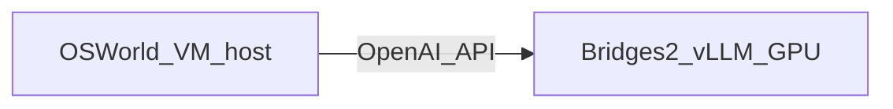

# OSWorld VM strategy (default until advisor confirms)

**Status:** Default **Option B** for pilot; scale with **Option C** if needed.

## Recommended architecture

| Phase | VM host | vLLM host | Rationale |
|---|---|---|---|
| Pilot (30 tasks) | Local Mac + Docker/KVM if available | Bridges `GPU-shared` | Fast iteration; SSH tunnel to vLLM |
| Core study (100×3) | AWS OSWorld Host-Client OR lab-approved KVM node | Bridges batch `vllm_serve_opencua.sbatch` | Parallel envs; inference on allocation |

## Option A — KVM on Bridges compute node

- **Pros:** Single cluster billing
- **Cons:** Nested virt often disabled; pilot may fail
- **Action:** Try 5-task pilot on RM node with Docker; abort if `/dev/kvm` missing

## Option B — Local VM + Bridges vLLM (pilot default)

1. Submit `sbatch scripts/bridges/vllm_serve_opencua.sbatch`
2. Note endpoint from `logs/vllm-endpoint-*.txt`
3. SSH tunnel from laptop: `ssh -L 8000:v016:8000 bridges2.psc.edu`
4. Run OSWorld locally with `OPENAI_BASE_URL=http://localhost:8000/v1`

## Option C — AWS OSWorld + Bridges vLLM (scale default)

- Use OSWorld AWS Host-Client guide for parallel `num_envs`
- Set agent API to Bridges GPU node hostname (same PSC network or tunnel)
- Confirm firewall: compute nodes must reach vLLM port 8000

## API routing checklist

- [ ] vLLM binds `0.0.0.0:8000` on GPU node
- [ ] OSWorld agent env: `OPENAI_API_BASE`, `MODEL_NAME=opencua-7b`
- [ ] Test: `curl http://<gpu-node>:8000/v1/models` from VM host
- [ ] Log vLLM node in every run manifest

## Advisor sign-off

| Question | Answer |
|---|---|
| VM host for core study | _pending_ |
| Charge ID | `cis260099p` |
| SU budget approved for ~15k steps | _pending_ |
