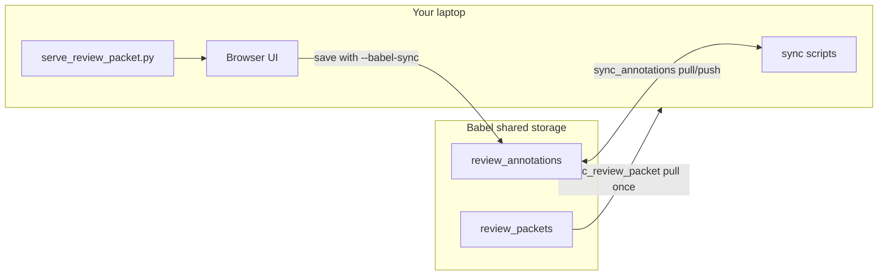

# Trace Review Labeling (abdoul + raghav)

Multi-annotator workflow for **taxonomy discovery** on paired pilot traces (30 tasks × 2 models = 60 traces). Judge labels are frozen in `packet_manifest.json`; human labels live in shared `annotations.json` on Babel.

**Lab status (2026-07):** Shared mattlab project root, shared venv, v4 pilot outputs, and packet `pilot_taxonomy_paired_20260703` are already on Babel. Day-to-day work is **laptop labeling** — not cluster setup.

## Registered annotators

| ID | Who |
|---|---|
| `abdoul` | Abdoul |
| `raghav` | Raghav |

Always pass your ID to `--annotator`. Saves only touch your namespace in `annotations.json`.

## Active packet

| Field | Value |
|---|---|
| Packet ID | `pilot_taxonomy_paired_20260703` |
| A3B run | `20260626_172919_a3b_pilot_full_v4` |
| 7B run | `20260626_172922_7b_pilot_full_v4` |
| Scope | 30 pilot tasks, paired A3B + 7B per task |
| Purpose | Qualitative taxonomy discovery **before** revising `failureTaxonomy.md` |

---

## Workflow overview



1. **Pull** the HTML packet once to your laptop (screenshots + HTML only; no run videos).
2. **Each session:** pull shared annotations → serve locally → label in browser → auto-push saves to Babel.
3. **After a batch:** pull annotations → run agreement / comparison reports.
4. **Later:** discuss disagreements → propose taxonomy revisions (requires Abdoul approval before editing `failureTaxonomy.md`).

Labeling never runs on Babel compute nodes. Only `annotations.json` is shared via sync scripts.

---

## Raghav onboarding (step-by-step)

Complete these on **your own laptop**. Abdoul has already run one-time lab setup (`init_shared_project.sh`, packet build). You skip that.

### 1. Get repo access

```bash
git clone git@github.com:MaximusAnax/pixel_agent.git
cd pixelAgent/errorAnalysis
git checkout feat/starting-failure-analysis
git pull
```

You need read access to the `MaximusAnax/pixel_agent` repo (ask Abdoul if clone fails).

### 2. Python environment (local labeling only)

```bash
python3 -m venv .venv
source .venv/bin/activate
pip install -e ".[dev]"
```

The shared Babel `.venv` is for cluster jobs; your laptop needs its own env to run `serve_review_packet.py`.

### 3. Babel config

```bash
cp config/babel.env.example config/babel.env
```

Edit `config/babel.env` and set **`BABEL_USER`** to your Babel username (not `andiongu`). Leave the shared mattlab paths as in the example — they are lab-wide:

- `BABEL_GROUP_ROOT=/data/group_data/mattlab/pixel_agent`
- `BABEL_SHARED_*` vars unchanged

Verify SSH from your laptop:

```bash
source config/babel.env
ssh "$BABEL_LOGIN"   # should reach login.babel.cs.cmu.edu
```

You do **not** need GitHub SSH on Babel for labeling. You do **not** run `init_shared_project.sh`.

### 4. Pull the review packet (one time)

```bash
source config/babel.env
scripts/babel/sync_review_packet.sh pilot_taxonomy_paired_20260703
```

Confirm:

```bash
ls data/review_packets/pilot_taxonomy_paired_20260703/index.html
```

### 5. First labeling session

```bash
source config/babel.env
git pull

scripts/babel/sync_annotations.sh pull pilot_taxonomy_paired_20260703

python scripts/serve_review_packet.py pilot_taxonomy_paired_20260703 \
  --annotator raghav --babel-sync
```

Open **http://127.0.0.1:8765/index.html**.

On the index you will see both annotators' progress. Abdoul's labels are read-only for you; your saves go under the `raghav` key only.

### 6. What to do while labeling

- Open a task pair (A3B + 7B for the same `task_id`).
- Read the instruction and step through the trace (screenshots + model reasoning).
- Compare **judge labels** (shown in the UI, from `packet_manifest.json`) to what you see.
- Record:
  - **Modes** (ordered — first = primary failure mode)
  - **Reasoning** (why this mode at this step)
  - **Confidence** and **root step** (`t*`)
- Use **Save**; with `--babel-sync`, labels push to Babel automatically.
- Do **not** edit `packet_manifest.json` or judge fields.

### 7. Checklist before you finish onboarding

- [ ] `ssh $BABEL_LOGIN` works
- [ ] Packet synced locally (`index.html` exists)
- [ ] Server starts without errors
- [ ] You labeled at least one episode and see it after refresh
- [ ] Abdoul can see your label on the index after you save (he pulls annotations)

---

## Daily labeling session (both annotators)

All commands from **`pixelAgent/errorAnalysis`** on your laptop.

```bash
source config/babel.env
git pull

# Always pull first — see partner's latest labels
scripts/babel/sync_annotations.sh pull pilot_taxonomy_paired_20260703

python scripts/serve_review_packet.py pilot_taxonomy_paired_20260703 \
  --annotator abdoul --babel-sync    # raghav: --annotator raghav

# Open http://127.0.0.1:8765/index.html
```

**Rules**

- Use **your** annotator ID every time.
- Pull annotations **before** each session.
- Never edit `packet_manifest.json`.
- Judge labels are reference only; human labels go in `annotations.json`.

---

## Push labels to Babel

Human labels must reach Babel so your partner can pull them. Local file:
`data/review_packets/<packet_id>/annotations.json`. Shared source of truth:
`.../pixel_agent/review_annotations/<packet_id>/annotations.json`.

### During labeling (automatic)

Always start the server with **`--babel-sync`**. Each **Save** in the browser:

1. Writes to your local `annotations.json` (under your annotator key only).
2. Runs `scripts/babel/sync_annotations.sh push <packet_id>` in the background.

If the server was started **without** `--babel-sync`, nothing is pushed until you run push manually.

### End of session or batch (confirm)

After you finish labeling for the day (or a batch), run push once to confirm:

```bash
source config/babel.env
scripts/babel/sync_annotations.sh push pilot_taxonomy_paired_20260703
```

Success looks like:

```text
Pushed annotations to Babel group path for pilot_taxonomy_paired_20260703
```

### Partner workflow

Before their next session, your partner runs:

```bash
scripts/babel/sync_annotations.sh pull pilot_taxonomy_paired_20260703
```

Then they should see your labels on the index (read-only under your annotator column).

### If push fails

- Check `ssh $BABEL_LOGIN` works from your laptop.
- Ensure `config/babel.env` has the correct `BABEL_USER` and shared `BABEL_GROUP_ROOT`.
- Retry `sync_annotations.sh push`; the script keeps a timestamped `.bak` on Babel before overwriting.

---

## After both label a batch

```bash
source config/babel.env
scripts/babel/sync_annotations.sh pull pilot_taxonomy_paired_20260703

python scripts/report_discovery_agreement.py \
  --manifest data/review_packets/pilot_taxonomy_paired_20260703/packet_manifest.json \
  --annotations data/review_packets/pilot_taxonomy_paired_20260703/annotations.json

python scripts/export_discovery_comparison.py \
  --manifest data/review_packets/pilot_taxonomy_paired_20260703/packet_manifest.json \
  --annotations data/review_packets/pilot_taxonomy_paired_20260703/annotations.json \
  --output data/labeling/discovery_comparison_abdoul_raghav.csv
```

Use the report and CSV to find disagreements, confusing pairs, and taxonomy gaps. Discuss before changing `failureTaxonomy.md`.

---

## Where state lives

| Artifact | Source of truth | How to sync |
|---|---|---|
| Code, scripts, this doc | **GitHub** + Babel shared clone | `git pull` locally |
| `config/babel.env` | **Your laptop** | Never commit |
| Analysis outputs | `.../pixel_agent/outputs/<run_id>/` | `publish_outputs_to_shared.sh` (legacy); `sync_outputs.sh` (pull to laptop) |
| HTML packet | `.../pixel_agent/review_packets/<packet_id>/` | `sync_review_packet.sh` |
| Human labels | `.../pixel_agent/review_annotations/<packet_id>/` | `sync_annotations.sh pull\|push` |
| Active packet | Babel `REVIEW_STATE.md` | Written at packet build |

Group data lives on **compute nodes**. Sync scripts stage through home via `srun` so login-node rsync works.

### Babel paths (mattlab)

```
/data/group_data/mattlab/pixel_agent/
  pixelAgent/                         # full git clone
  outputs/<run_id>/                   # shared HF analysis runs
  review_packets/<packet_id>/
  review_annotations/<packet_id>/annotations.json
  .venv/                              # shared Python env (cluster jobs)
  REVIEW_STATE.md
  BABEL_SETUP.md
```

Per-user HF cache (not shared): `/data/group_data/mattlab/$USER/`

---

## Maintainer workflows (Abdoul)

These are **not** needed for everyday labeling.

### Before a new Babel job or packet rebuild

```bash
git push
scripts/babel/sync_shared_repo.sh pull
```

### Publish legacy runs to shared outputs

If a run exists only in home mirror or old `user_data` paths, publish before `build_review_packet.sh`:

```bash
source config/babel.env
scripts/babel/publish_outputs_to_shared.sh \
  20260626_172919_a3b_pilot_full_v4 \
  20260626_172922_7b_pilot_full_v4
```

The script checks, in order:

1. `~/cua-failure-analysis/data/babel_outputs/<run_id>/`
2. `/data/user_data/$USER/cua_failure_analysis/outputs/<run_id>/`

…and copies compact `*.json`, `*.jsonl`, `*.csv`, `*.md` to `.../pixel_agent/outputs/<run_id>/`.

### Build or rebuild a review packet

```bash
git push
scripts/babel/sync_shared_repo.sh pull

PACKET_ID=pilot_taxonomy_paired_20260703 \
A3B_RUN=20260626_172919_a3b_pilot_full_v4 \
B7_RUN=20260626_172922_7b_pilot_full_v4 \
scripts/babel/build_review_packet.sh
```

Then each annotator runs `sync_review_packet.sh <packet_id>`.

### Pull analysis outputs to laptop (optional)

```bash
scripts/babel/sync_outputs.sh 20260626_172919_a3b_pilot_full_v4
```

---

## Conflict avoidance

- **Pull before session** — partner labels appear read-only on the index.
- Saves merge by annotator key — abdoul and raghav never overwrite each other.
- Push creates a timestamped `.bak` on Babel.

## Schema (annotations.json v2)

```json
{
  "schema_version": 2,
  "packet_id": "pilot_taxonomy_paired_20260703",
  "annotators": {
    "abdoul": { "labels": { "a3b/chrome__uuid": { "modes_ordered": ["..."], ... } } },
    "raghav": { "labels": {} }
  }
}
```

Primary mode for agreement = first entry in `modes_ordered`.

---

## Troubleshooting

### `ModuleNotFoundError: pydantic` on Babel jobs

Shared venv must be at `.../pixel_agent/.venv`:

```bash
source config/babel.env
scripts/babel/bootstrap_shared_venv.sh
```

### `StopIteration` during `build_review_packet.sh`

Shared output dirs are empty — publish runs first:

```bash
scripts/babel/publish_outputs_to_shared.sh <a3b_run_id> <7b_run_id>
```

### `sync_review_packet.sh` fails or packet missing

Confirm packet on Babel (`REVIEW_STATE.md`) and rebuild if needed (maintainer section above).

### Partner cannot see my labels

Confirm you used `--babel-sync` and they ran `sync_annotations.sh pull` before serving.

### Template changed but packet already synced locally

Re-render HTML from the existing on-disk screenshots (no Babel rebuild):

```bash
python scripts/refresh_review_packet_html.py pilot_taxonomy_paired_20260703
```

Restart `serve_review_packet.py` after refreshing.

---

## One-time lab setup (already done)

Abdoul completed this; **Raghav skips it.**

```bash
source config/babel.env
scripts/babel/init_shared_project.sh   # shared clone + .venv + dirs
```

For new environments or disaster recovery, see [babel_hf_orchestration.md](babel_hf_orchestration.md) (GitHub SSH on Babel, `bootstrap_shared_venv.sh`, partial clone cleanup).

---

## Related docs

- [babel_hf_orchestration.md](babel_hf_orchestration.md) — Babel storage and Slurm
- [AGENTS.md](../../AGENTS.md) — project boundaries
