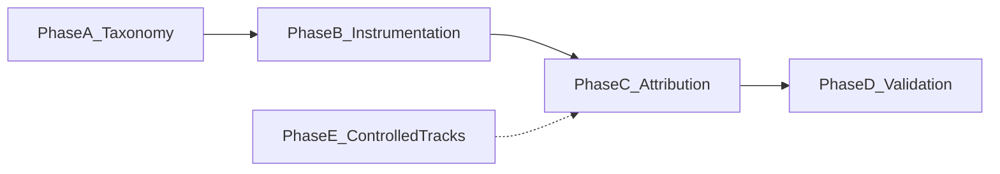

# CUA Failure Analysis — Final Plan

**Version:** 1.0 (final)  
**Deliverable:** Publishable, human-validated failure taxonomy with quantitative prevalence on a stratified OSWorld subset.

This document is the **single entry point** for the project. Detailed specs live in the linked files below.

---

## Document map

| Document | Purpose |
|---|---|
| [failureTaxonomy.md](failureTaxonomy.md) | 16-leaf ontology, examples, **decision rules**, multi-label policy |
| [failureStudyProtocol.md](failureStudyProtocol.md) | Phases A–E methodology, attribution pipeline, compute runbooks |
| [failureAnalysisPlan.md](failureAnalysisPlan.md) | Experiment design: models, tracks, metrics, infrastructure |

---

## Research questions

1. **What** failure modes dominate for small vs mid CUAs on OSWorld at the first failure step `t*`?
2. **How** do perception/grounding failures (6 leaves) compare to cognitive/planning failures (10 leaves)?
3. **Which** modes co-occur or propagate (e.g., early grounding error → later Action Looping)?
4. **Can** a hybrid pipeline (programmatic detectors + calibrated VLM judge) match human labels well enough to scale?

---

## Taxonomy (16 leaves — frozen)

**Perception/Grounding (6):** Click Region Error, Visual Confusion, Text Matching Bias, Resolution/Scale Brittleness, Fine-Grained Manipulation Failure, Software Commonsense Failure

**Cognitive/Planning (10):** Action Looping, Location Hallucination, Spatial Reasoning Error, Goal Hallucination, Reasoning Drift, Long-Horizon Memory Failure, Instruction Ambiguity Failure, Refusal/Infeasibility Error, Hidden Operation Blindness, Cross-Application Context Loss

**Meta-labels:** `evaluator_mismatch`, `propagated_failure`

Full definitions and decision rules: [failureTaxonomy.md](failureTaxonomy.md)

---

## Methodology (5 phases)

| Phase | Weeks | Exit criterion |
|---|---|---|
| **A** Taxonomy | 1–2 | Decision rules written; annotator rubric ready |
| **B** Instrumentation | 2–3 | Trace JSON + Tier-1 detectors on pilot |
| **C** Attribution | 3–5 | Every failed run has `t*` + primary label |
| **D** Validation | 5–8 | Per-leaf κ; judge calibrated; prevalence CIs |
| **E** Controlled tracks | 4–8 | Separate tables per track (zoom, ambiguity, etc.) |

Detail: [failureStudyProtocol.md](failureStudyProtocol.md)

---

## Attribution pipeline (summary)

1. Run agent on OSWorld → log per-step trace (screenshot, action, coords, CoT, a11y)
2. On failure → identify **first failure step** `t*`
3. Apply **decision tree** + Tier-1 programmatic detectors
4. Unresolved → **VLM judge** (screenshot at `t*` + CoT; never trajectory-only)
5. Human gold set (150–200 steps, 2 annotators) → calibrate judge

**Judge output:** `{primary_mode, secondary_modes[], propagated, t_star, tier_used, confidence}`

---

## Models

| Role | Model | Serving |
|---|---|---|
| Ultra-small agent | Qwen3.5-VL-0.8B | vLLM |
| Trained small CUA | OpenCUA-7B | vLLM (`--trust-remote-code`, ≥0.12.0) |
| Optional mid | OpenCUA-32B or Qwen3.5-VL-9B | vLLM |
| Judge (draft) | Qwen3.5-VL-9B+ | vLLM on separate GPU job |
| Judge (validation) | Frontier API or ≥32B | Calibration only |

OpenTau is **not used** (robotics VLA training). Use OpenCUA + AgentNetBench.

---

## Compute scope (agreed)

| Stage | Scope | Agent-steps (approx) |
|---|---|---|
| Pilot | 30 tasks × 1 seed × 1 model | ~1.5k |
| **Core study** | **100 tasks × 3 seeds × 2–3 models** | **~15k** |
| Extension (optional) | 200 × 3 × 3 | ~30k |

Pass@3 for core study. Not 369×10 unless reliability becomes a separate RQ.

Judge labels **first failure step only** on failed runs (~200–800 instances).

---

## Compute infrastructure

### Primary: PSC Bridges-2 (allocation active)

Use Bridges-2 for **GPU inference** (vLLM agent + judge) and **offline work** (AgentNetBench, judge batch labeling).

- SSH: `bridges2.psc.edu`
- File transfer: `data.bridges2.psc.edu`
- Scheduler: SLURM (`interact`, `sbatch`)
- GPU partitions: `GPU-shared` (1–4 GPUs, cost-efficient) or `GPU` (full node, 8 GPUs)
- Check allocation: `projects` → use `-A <charge_id>` on every job
- Storage: Ocean (`$PROJECT`, `$HOME`)

**Never run vLLM or heavy jobs on login nodes.**

### Secondary: CMU Babel (pending account)

Request access via LTI intranet when ready. Use for additional GPU capacity or if lab standardizes on Babel. Same split architecture as Bridges.

### OSWorld VMs (likely off-cluster)

Bridges/Babel GPU nodes are for **inference**, not nested KVM desktops. OSWorld VM workloads typically run:

- **Option A:** Same compute node if KVM available (pilot with 5 tasks first)
- **Option B:** Local machine or **AWS** (OSWorld-supported) for VM env; vLLM on Bridges; agent calls `http://<bridges-gpu-node>:8000/v1` via VPN/SSH tunnel if needed
- **Option C:** AWS parallel eval (OSWorld Host-Client) with vLLM on Bridges

**Action:** Confirm with advisor which option the group uses.

Runbooks: [failureStudyProtocol.md — Compute](failureStudyProtocol.md#compute-infrastructure)

---

## Controlled tracks (separate result tables)

| Track | Leaves |
|---|---|
| Standard subset | All |
| Relational vs direct | Spatial Reasoning, Text Matching |
| Underspecified (~20%) | Instruction Ambiguity |
| Infeasible | Refusal/Infeasibility |
| Zoom 70/100/150% | Resolution/Scale Brittleness |
| Multi-app | Cross-Application Context Loss |

Detail: [failureAnalysisPlan.md](failureAnalysisPlan.md)

---

## Success criteria

- [ ] Per-model prevalence for all 16 leaves at `t*` with CIs
- [ ] Co-occurrence + propagation rates
- [ ] Inter-rater κ **per leaf** (target κ ≥ 0.6 where feasible)
- [ ] Judge-vs-human agreement per leaf with 5+ anchors each
- [ ] Hidden Operation Blindness rate reported for OSWorld
- [ ] Cross-Application Context Loss on `cross_app` tasks only

**Not sufficient:** success rates alone or uncalibrated judge pie chart.

---

## Immediate next steps (ordered)

1. ~~**Bridges:** SSH login, `my_quotas`~~ ✅ (`cis260099p`, allocation active)
2. ~~**GPU session:** `interact -A cis260099p -p GPU-shared --gres=gpu:1`~~ ✅ Node **v016**, job 41513793
3. **vLLM smoke test** ← **current** (run on `v016` before `exit`)
4. **Advisor:** Confirm OSWorld VM strategy (KVM vs AWS/local) + API routing to vLLM
5. **AgentNetBench** pilot on Bridges
6. **Pre-register** 100-task stratified list with task tags
7. **Babel:** Submit account request (non-blocking)
8. **Human labeling:** Recruit second annotator after 30-task pilot traces exist

---

## Timeline

| Weeks | Milestone |
|---|---|
| 1–2 | Taxonomy rubric finalized; Bridges vLLM smoke test; AgentNetBench pilot |
| 2–3 | Trace logger + Tier-1 detectors; 30-task OSWorld pilot |
| 3–5 | Core 100×3×3 runs; hybrid attribution pipeline |
| 5–8 | Human gold labels; judge calibration; prevalence analysis |
| 4–8 (parallel) | Controlled tracks |

---

## Revision history

| Version | Change |
|---|---|
| 1.0 | Final plan: 16 leaves, decision rules, Bridges-primary compute, agreed 100×3×3 scope |
