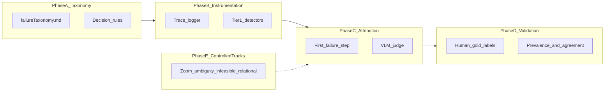
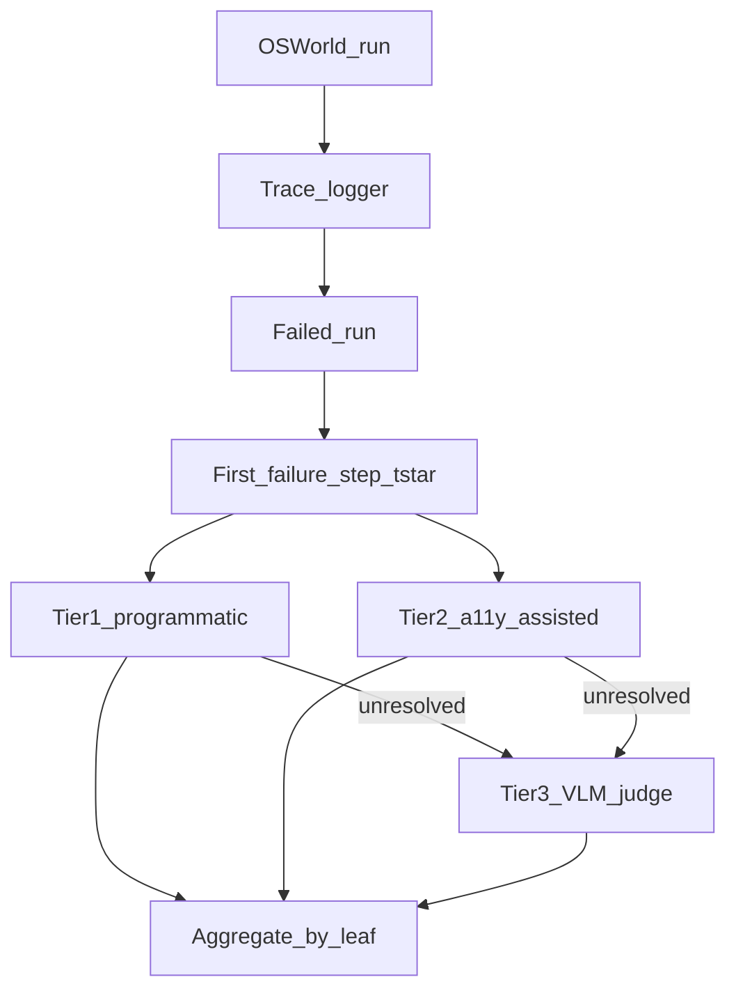
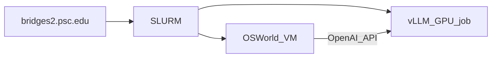

# Failure Study Protocol

This document is the **agreed methodology** for the computer-use agent (CUA) failure-mode analysis project. It implements the study design from our taxonomy review and supersedes ad-hoc notes in the critique plan for **execution phases only**.

**Related documents:**

- [failureAnalysisFinalPlan.md](failureAnalysisFinalPlan.md) — **master plan (v1.0)**
- [failureTaxonomy.md](failureTaxonomy.md) — 16-leaf failure ontology (definitions + examples + decision rules)
- [failureAnalysisPlan.md](failureAnalysisPlan.md) — experiment design, models, controlled tracks, metrics

**Primary deliverable:** A publishable, human-validated failure taxonomy with quantitative prevalence estimates on a stratified OSWorld subset.

---

## Overview



---

## Phase A — Taxonomy hardening (weeks 1–2)

**Status:** Complete (v1.0). Decision rules in [failureTaxonomy.md](failureTaxonomy.md).

### Done

- 16 leaf categories with examples in [failureTaxonomy.md](failureTaxonomy.md)
- Two top-level domains: Perception/Grounding (6 leaves) and Cognitive/Planning (10 leaves)
- **Hidden Operation Blindness** (leaf 15), **Cross-Application Context Loss** (leaf 16)
- **Decision rules**, global decision order, multi-label policy, controlled-track gating
- Master plan: [failureAnalysisFinalPlan.md](failureAnalysisFinalPlan.md)

### Optional follow-up

- Add 5+ **anchor examples per leaf** for judge calibration prompts (Phase D)
- Revisit **Visual State Misunderstanding** only if pilot labeling shows systematic gap

### Multi-label policy

At the **first failure step** `t*`:

- Assign exactly **one primary** root-cause label
- Optionally assign **secondary** labels when multiple modes co-occur at the same step
- Tag **propagated** when a later failure (e.g., Action Looping, Long-Horizon Memory Failure) is caused by an earlier error at step `t' < t*`

### Meta-labels (orthogonal to taxonomy)

| Meta-label | When to use |
|---|---|
| `evaluator_mismatch` | Agent action is reasonable per human rubric but OSWorld script marks failure |
| `propagated_failure` | Failure at `t*` is downstream of root cause at earlier step |

### Confusion decision tree (high-priority pairs)

Full rules: [failureTaxonomy.md — Labeling policy](failureTaxonomy.md). Summary at `t*`:

1. **Action Looping** — ≥3 repeated actions without state change
2. **Spatial Reasoning Error** — relational instruction + correct landmark + wrong relative click
3. **Click Region Error** — CoT names T; click near T but outside bbox
4. **Location Hallucination** — CoT names T; click far from T
5. **Hidden Operation Blindness** — goal understood; hidden affordance never attempted
6. **Residual** — VLM judge with screenshot + CoT

---

## Phase B — Instrumentation (weeks 2–3)

### Trace schema

Log per step for every OSWorld run:

```json
{
  "task_id": "string",
  "seed": "int",
  "step": "int",
  "screenshot_path": "string",
  "action": "object",
  "coords": [x, y],
  "cot": "string",
  "eval_signals": "object",
  "a11y_snippet": "object",
  "task_tags": ["relational", "underspecified", "infeasible", "fine_manipulation", "cross_app", "zoom_stress"]
}
```

### Tier-1 programmatic detectors (build first)

| Leaf | Detector |
|---|---|
| Action Looping | Repetition ratio ≥3 identical contiguous actions without eval state change |
| Click Region Error | CoT semantic match to element E + click outside E bbox within margin |
| Location Hallucination | CoT names E + click distance to E > threshold, not near any plausible target |
| Long-Horizon Memory Failure (weak) | Failure step index vs task-length decay curve |

### Task tags (pre-register at task selection)

| Tag | Leaves exercised |
|---|---|
| `relational` | Spatial Reasoning Error |
| `underspecified` | Instruction Ambiguity Failure |
| `infeasible` | Refusal/Infeasibility Error |
| `fine_manipulation` | Fine-Grained Manipulation Failure |
| `cross_app` | Cross-Application Context Loss |
| `zoom_stress` | Resolution/Scale Brittleness |

Do **not** assign controlled-track leaves on standard runs without the matching tag.

---

## Phase C — Attribution pipeline (weeks 3–5)



### First failure step `t*`

Identify the earliest step where either:

- OSWorld evaluator would fail if the run stopped there, or
- The agent's action diverges from a viable path (programmatic heuristics + optional human demo from OSWorld-Human)

### Trace step semantics (OpenCUA / similar)

Per step in `traj.jsonl`-style logs, treat these as **distinct**:

| Field | Meaning |
|---|---|
| **Observation (before action)** | Screenshot at step *k* = UI state when choosing action *k* |
| **Executed action (trajectory)** | What the runtime ran on the VM (often absolute pixels) |
| **Model code (CoT)** | Code block in the model response (often normalized 0–1 coords) |
| **Stated intent (CoT)** | Natural-language `## Action:` (or equivalent) section |

Post-action visual state is the **next** step’s observation (no separate post-image in typical HF zips). A programmatic `grounding_mismatch` flag may mark when executed vs proposed coords diverge beyond tolerance after normalization — evidence for Click Region Error / Location Hallucination / Fine-Grained Manipulation, not a taxonomy leaf.

### VLM judge input bundle (step `t*` only)

Required context for attribution (annotation-ready / `osworld_v1` and later):

- **Canonical task instruction** from OSWorld task JSON (not only the agent-visible / traj-truncated string)
- **OSWorld evaluator bundle:** outcome (`result.txt`), `evaluator` rules, and a **per-func** summary of what the metric checks (do not dump all OSWorld metrics)
- **Model observation** at `t*` (screenshot) with predicted click/action overlay when available
- **Executed action** (trajectory) vs **model code (CoT)** vs **stated intent** at `t*`
- Previous 2–3 steps (compressed)
- Evaluator failure message / failed assertion when available (else binary score + eval bundle)
- Taxonomy decision tree for confusable pairs
- **Human reference path (non-binding):** full OSWorld-Human / Human Agent sequence — each human step’s action text **plus** observation screenshot when Human Agent artifacts exist

**Human reference contract:** The human sequence is **one viable path**, not the only valid path. Do **not** require step-wise alignment to the agent trace, and do **not** penalize agent actions that diverge from the human path if they still progress toward OSWorld success criteria. Prefer labeling agent failure modes over “didn’t match human.”

**Provisional vs gold:** Versioned judge labels (`judge_context_version`) are provisional reference during discovery. Human labels in `annotations.json` are gold-in-progress. Calibrate the judge against adjudicated gold in Phase D — not during the first enriched rejudge.

**Do not** judge from trajectory text alone. OSWorld success is execution-based, not reference-trajectory matching.

**Timing:** Provisional multimodal rejudge (`osworld_v1`) waits until Human Agent screenshots are ready for the episode (`oracle_status` ready or partial). Never overwrite prior judge outputs — write a new version.

### Judge output schema

```json
{
  "primary_mode": "leaf_name",
  "secondary_modes": ["leaf_name"],
  "propagated": false,
  "tier_used": "programmatic|a11y|judge",
  "evidence_cot_span": "string",
  "confidence": 0.0,
  "t_star": 0
}
```

### Models

| Role | Model | Serving |
|---|---|---|
| Ultra-small agent | Qwen3.5-VL-0.8B | vLLM on PSC Bridges-2 |
| Trained small CUA baseline | OpenCUA-7B | vLLM on Bridges (`--trust-remote-code`) |
| Optional mid baseline | OpenCUA-32B or Qwen3.5-VL-9B | vLLM, tensor parallel if needed |
| Judge (draft) | Qwen3.5-VL-9B+ | Separate vLLM job on Bridges |
| Judge (validation) | Frontier API or ≥32B | For calibration against human gold set |

---

## Phase D — Validation for publication (weeks 5–8)

**Prerequisite:** Annotation-ready pilot packet + discovery labeling by `abdoul` / `raghav`. Phase D is **after** human gold exists — not the current milestone.

### Human gold set

- **150–200** first-failure steps labeled by **two annotators**
- Stratify across all **16 leaves** (target ≥10 examples per leaf where feasible)
- Third-pass adjudication on disagreements
- Report **per-leaf** Cohen's κ (not overall κ only)

### Judge calibration

- **5+ anchor examples per leaf** in judge prompt
- Report judge-vs-human agreement per leaf (compare pre-context vs `osworld_v1` vs gold-calibrated)
- Ablations: judge size, with/without CoT, with/without human reference images

### Reportable outcomes

1. Prevalence of each leaf at `t*`, per model, with confidence intervals (**human gold**, not provisional judge alone)
2. Co-occurrence matrix among leaves
3. Fraction of Long-Horizon / Action Looping failures that are `propagated`
4. Hidden Operation Blindness rate vs grounding rate on OSWorld
5. Cross-Application Context Loss rate on `cross_app`-tagged tasks only
6. `evaluator_mismatch` rate

---

## Phase E — Controlled tracks (parallel; after Phase A rules are stable)

Run only after decision rules are written. Report in **separate tables** from the standard track.

| Track | Leaves | Scope |
|---|---|---|
| Standard OSWorld subset | All leaves except controlled-only | 100 tasks × 3 seeds × 2–3 models |
| Relational vs direct grounding | Spatial Reasoning, Text Matching | 20–40 task variants |
| Underspecified tasks | Instruction Ambiguity | ~20% of curated subset, pre-registered rubric |
| Infeasible tasks | Refusal/Infeasibility | 10–15 tasks + CALL_USER simulation |
| Zoom stress | Resolution/Scale Brittleness | Same task IDs at 70% / 100% / 150% zoom |
| Cross-app tasks | Cross-Application Context Loss | OSWorld multi-app tasks tagged `cross_app` |

---

## Compute scope (agreed)

**Primary study:** 100 stratified tasks × 3 seeds × 2–3 models ≈ **15k agent-steps**.

| Scope | Tasks × seeds × models | Agent-steps (approx) | Use |
|---|---:|---:|---|
| Pilot | 30 × 1 × 1 | ~1.5k | Pipeline debugging |
| **Core study (agreed)** | **100 × 3 × 3** | **~15k** | Taxonomy prevalence paper |
| Extension | 200 × 3 × 3 | ~30k | Stronger CIs |
| Full OSWorld-Verified | 369 × 3 × 3 | ~55k | Optional; not required for taxonomy |

Judge labeling: first failure step only on failed runs (~200–800 instances), not every step.

**Not in scope for this phase:** 369 × 10 Pass^k runs unless reliability becomes a separate research question.

---

## Compute infrastructure

**Primary:** PSC Bridges-2 (active allocation)  
**Secondary:** CMU Babel (account pending — request in parallel, non-blocking)

OSWorld + vLLM uses a **split architecture**: GPU inference on HPC; OSWorld VMs on KVM-capable node, local machine, or AWS per group policy.

### PSC Bridges-2 (primary)

| Item | Detail |
|---|---|
| Login | `ssh <psc_username>@bridges2.psc.edu` |
| File transfer | `data.bridges2.psc.edu` (not login nodes) |
| Scheduler | SLURM — `interact`, `sbatch`, `squeue` |
| Allocation | `projects` → note charge ID; use `-A <charge_id>` on every job |
| GPU partitions | `GPU-shared` (1–4 GPUs, cheaper) or `GPU` (full 8-GPU node) |
| GPUs | V100 / A100 (check `sinfo`) |
| Storage | Ocean — `$HOME`, `$PROJECT` |

**Rule:** Never run vLLM, OSWorld, or training on login nodes.

#### Recommended job layout



| Job | Resources | Purpose |
|---|---|---|
| vLLM serve | `GPU-shared`, 1 GPU, 8 cores, 60G | OpenCUA-7B / Qwen3.5-VL agent |
| Judge batch | `GPU-shared`, 1 GPU | Label failed traces |
| AgentNetBench | 1 GPU or RM-shared CPU | Offline pilot |
| OSWorld runner | CPU + KVM if available; else AWS/local | VM env → calls vLLM endpoint |

#### Bridges interactive example (vLLM smoke test)

```bash
# On login node — request one GPU (replace CHARGE_ID)
interact -A CHARGE_ID -p GPU-shared --gres=gpu:1 -t 4:00:00

# Inside allocation
module load anaconda3  # or group conda module
conda activate <your_env>
pip install 'vllm>=0.12.0'

vllm serve xlangai/OpenCUA-7B \
  --trust-remote-code \
  --served-model-name opencua-7b \
  --host 0.0.0.0 \
  --port 8000
```

Note the compute node hostname (`hostname`) for OSWorld to reach the API.

#### Bridges batch example

```bash
#!/bin/bash
#SBATCH -A CHARGE_ID
#SBATCH -p GPU-shared
#SBATCH --gres=gpu:1
#SBATCH -t 24:00:00
#SBATCH -N 1
#SBATCH --ntasks-per-node=1
#SBATCH --cpus-per-task=8
#SBATCH --mem=60G
#SBATCH -J cua-vllm
#SBATCH -o logs/vllm-%j.out

module load anaconda3
source activate <your_env>

export VLLM_NODE=$(hostname)
echo "vLLM endpoint: http://${VLLM_NODE}:8000/v1"

vllm serve xlangai/OpenCUA-7B \
  --trust-remote-code \
  --served-model-name opencua-7b \
  --host 0.0.0.0 \
  --port 8000
```

#### Service units (budget)

Bridges charges **Service Units (SUs)** by node type and wall time. For core study (~15k agent-steps):

- Estimate GPU-hours for vLLM inference + judge labeling
- Run `my_quotas` on Bridges to track remaining allocation
- Start with **pilot** (30 tasks) to measure SU burn rate before scaling

Docs: [Bridges-2 User Guide](https://www.psc.edu/resources/bridges-2/user-guide/)

### CMU Babel (secondary — pending)

Account not yet provisioned. When ready:

1. LTI intranet → HPC Cluster User Account Request (`babel`)
2. Safety quiz on [hpc.cs.cmu.edu](https://hpc.cs.cmu.edu/)
3. SSH: `login.babel.cs.cmu.edu`
4. Same split architecture and vLLM commands as Bridges

Use Babel for overflow GPU or if lab standardizes workflows there.

### OSWorld VM strategy (confirm with advisor)

| Option | Where | When to use |
|---|---|---|
| A | KVM on HPC compute node | If partition supports nested virt; pilot first |
| B | Local laptop + Bridges vLLM | Small pilots; SSH tunnel to vLLM port |
| C | AWS OSWorld Host-Client | Scale parallel eval; vLLM stays on Bridges |

### Storage layout (both clusters)

```
$PROJECT/cua-failure-analysis/
  traces/{model}/{task_id}/{seed}/
  screenshots/
  labels/
  results/
  logs/
```

### Pilot order

1. Bridges login + `projects` + `my_quotas`
2. **AgentNetBench** offline (validates detectors; minimal SUs)
3. **vLLM** smoke test on `GPU-shared` (OpenCUA-7B)
4. **OSWorld** 5-task pilot (`num_envs=1`)
5. Scale to **100-task stratified subset**
6. Submit Babel account request (parallel)

### Open questions for advisor

- Bridges charge ID (`-A`) and SU budget for core study?
- OSWorld VMs: Bridges KVM, AWS, or local?
- Group conda/container with `vllm>=0.12.0` + OSWorld deps?
- Network path from VM host to Bridges GPU node for API calls?

---

## Phase timeline summary

| Phase | Weeks | Exit criterion |
|---|---|---|
| A — Taxonomy hardening | 1–2 | Decision rules in failureTaxonomy.md; rubric ready |
| B — Instrumentation | 2–3 | Trace JSON emitted; Tier-1 detectors run on pilot traces |
| **C′ — Annotation-ready** | **Now** | OSWorld context + Human Agent screenshots in UI/judge; mockup-approved dual-trace packet; provisional `osworld_v1` |
| C — Attribution (scaled) | 3–5 | Failed runs get `t*` + primary label (hybrid pipeline) |
| D — Validation | 5–8 | κ and prevalence tables per model; judge calibrated vs **human gold** |
| E — Controlled tracks | 4–8 (parallel) | Separate tables per track |

---

## Immediate next steps

1. Phase 0 grounding freeze + Abdoul sign-off (`docs/GROUNDING_MANIFEST.md`)
2. Annotation-ready infrastructure (vendor metadata, UI mockups, Human Agent, `osworld_v1` rejudge)
3. Discovery labeling on pilot packet (`abdoul` + `raghav`)
4. Agreement diagnostics → Phase D gold set + judge calibration
5. Core 100-task prevalence (after calibration)
